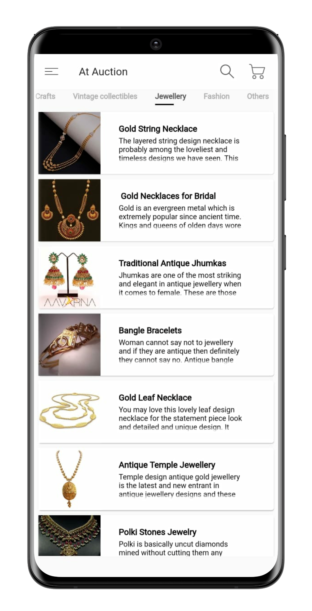
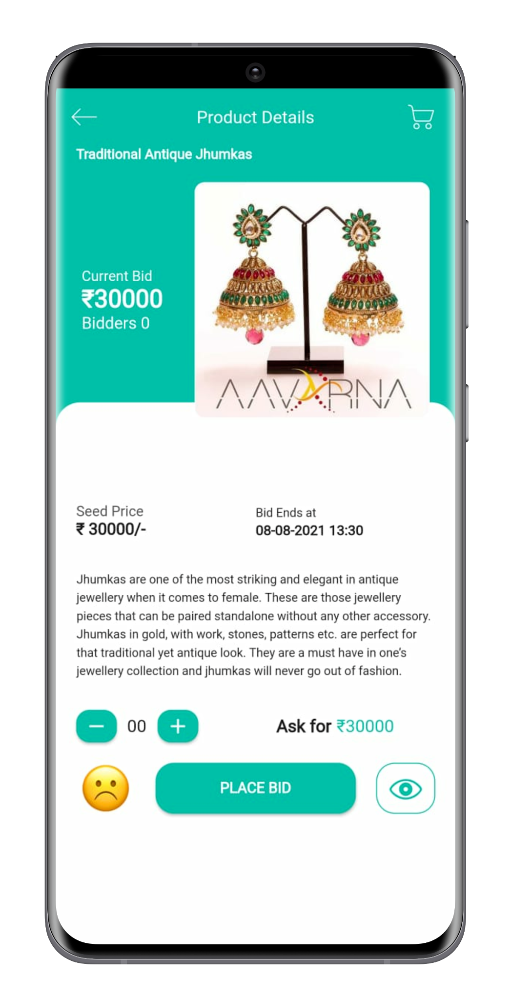
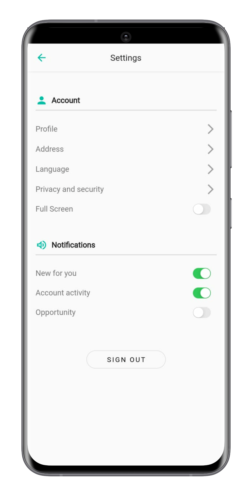
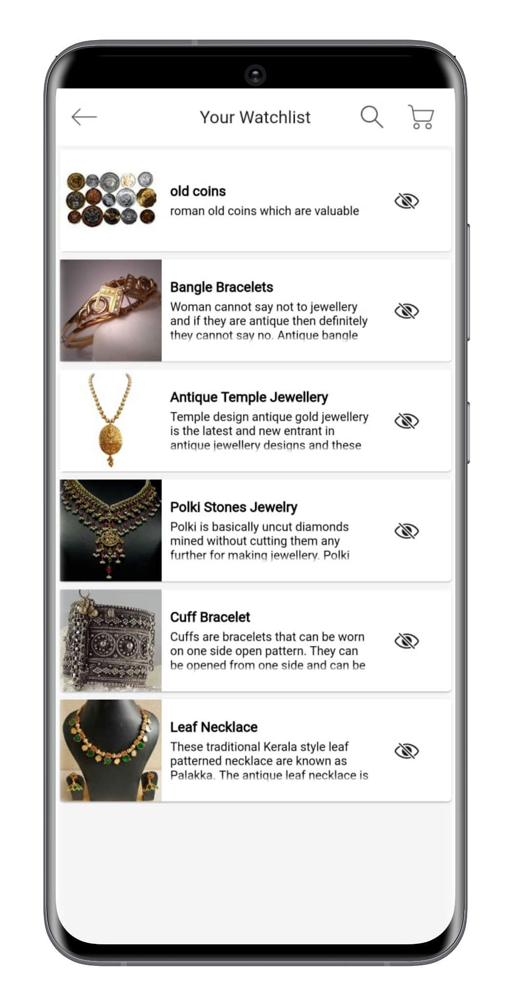
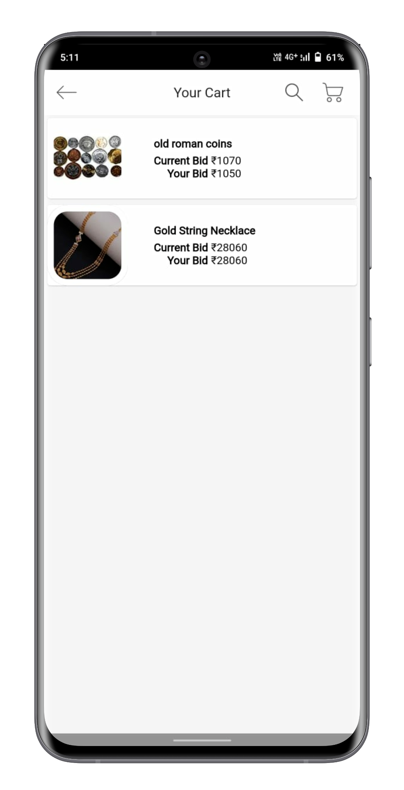
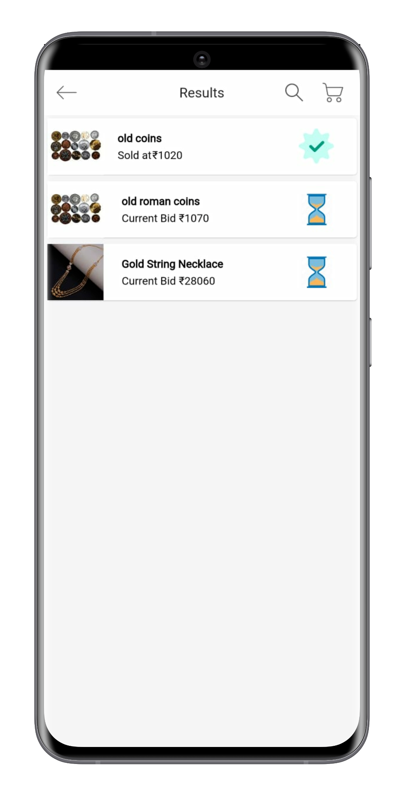
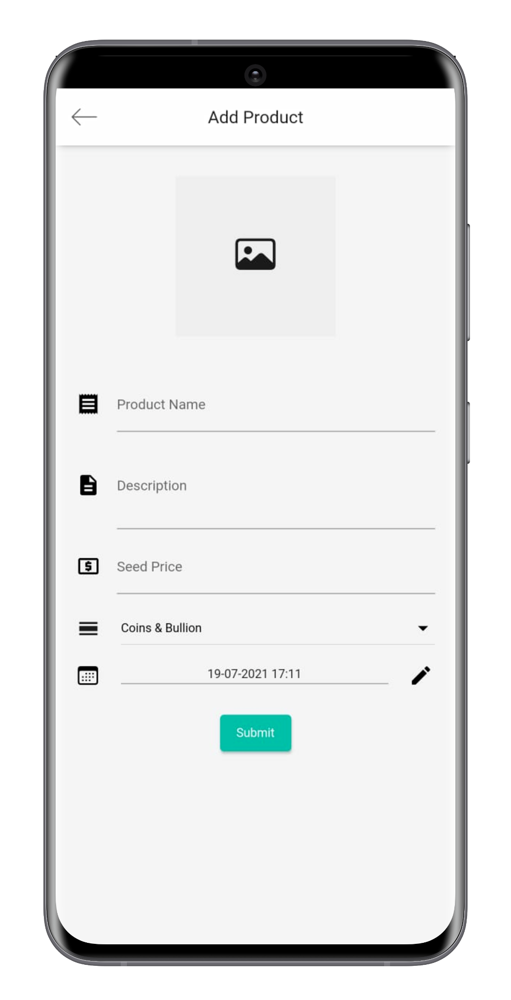
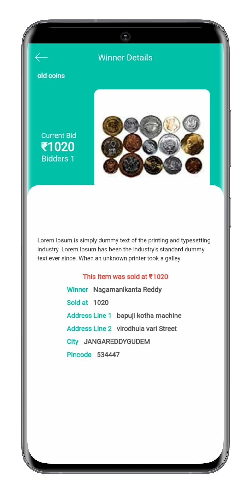

# atauction
- Auction is a popular method for buying and selling products. AT Auction is a bidding platform that helps users to sell and buy products at the best price. These systems provide functionalities like people who are registered with this application can participate in Auction from anywhere they want.
- In this system, sellers can easily add their products for auction and anyone can Bid or participate in that auction. 

## Features 

<table>
  <tr>
     <td style="text-align:center">Home Screen</td>
     <td>Details Screen</td>
     <td>Settings</td>
  </tr>
  <tr>
    <td valign="top"></td>
    <td valign="top"></td>
    <td valign="top"></td>
  </tr>
 </table>
  
 <table>
  <tr>
     <td>Watchlist Screen</td>
     <td>Cart Screen</td>
     <td>Results</td>
  </tr>
  <tr>
    <td valign="top"></td>
    <td valign="top"></td>
    <td valign="top"></td>
  </tr>
</table>
<table>
  <tr>
     <td>New Item Screen</td>
     <td>Winner Screen</td>
  </tr>
  <tr>
    <td valign="top"></td>
    <td valign="top"></td>
  </tr>
 </table>

## Getting Started

This project is a starting point for a Flutter application.

A few resources to get you started if this is your first Flutter project:

- [Lab: Write your first Flutter app](https://flutter.dev/docs/get-started/codelab)
- [Cookbook: Useful Flutter samples](https://flutter.dev/docs/cookbook)

For help getting started with Flutter, view our
[online documentation](https://flutter.dev/docs), which offers tutorials,
samples, guidance on mobile development, and a full API reference.
